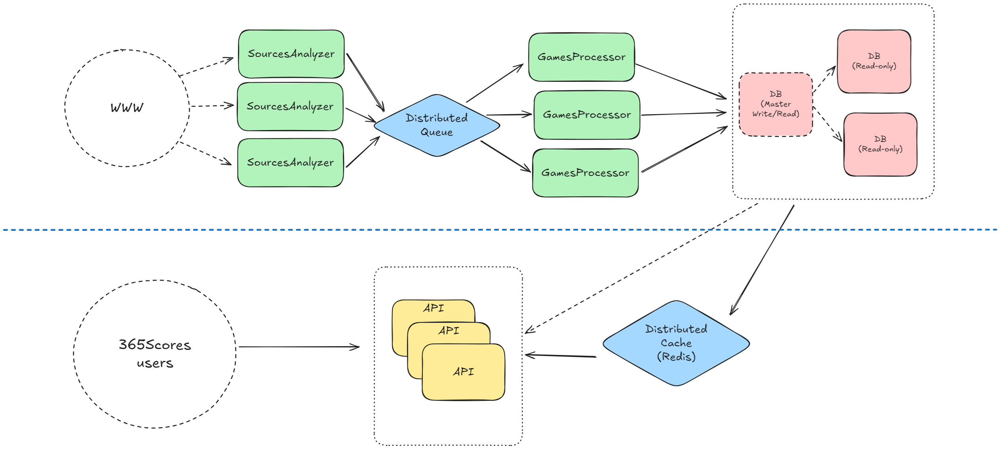

# Repository structure

### The projects in the repository are very abstract, just to show the idea of how the system could be designed

Below is a draft example of how the system could be designed to support horizontal scaling:

#### The solution has the following projects
- `SourcesAnalyzer` - can be background task/job to constantly analyze the source web apps and aggregate Games information into a distributed queue (e.g. Kafka or RabbitMQ);
- `GamesProcessor` - also some kind of a background worker to process the data provided by `SourcesAnalyzer` via queue and put the results into the persistent storage (e.g. Database);
- `Infrastructre` project - a library containing some examples of storage logic implementation;
- `Api` - simple API project to expose Games information;
- `Tests` - tests project with several unit-tests covering unique game identification rules.

**P.S.** I haven't gone to much deep in details of implementation because it will take time to architect all the system. Just tried to collect needed projects and show some logic on unique Game identification (you can run Tests to validate it).
Also, I didn't cover any part related to the DB structure, but it can be separately discussed if needed.